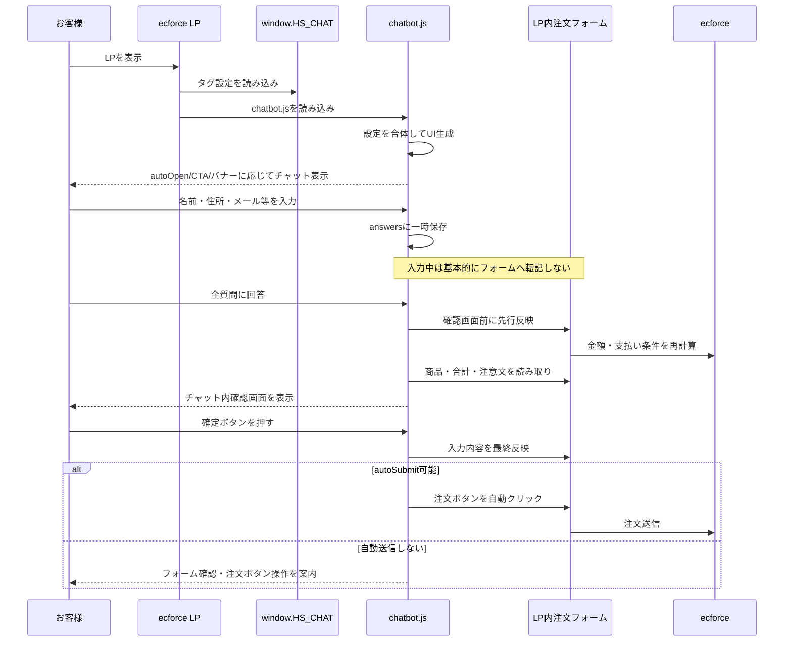

# HugSkin チャットボット 全体仕組み資料

この資料は、HugSkinのecforce LPに設置しているチャットボットが、どのタイミングで何をしているかをまとめたものです。

特に重要な結論:
- お客様がチャットに入力している最中は、基本的にecforce注文フォームへは転記していない。
- 入力内容はブラウザ内の一時データとして保持される。
- 確認画面を出す直前に、金額や注意文を正しく表示するため、LP内フォームへ先行反映することがある。
- 確認画面の確定ボタンを押した後に、注文フォームへの本転記と自動送信が行われる。

---

## 1. 全体像

チャットボットは、ecforceのLPにタグを貼るだけで動く、1ファイル完結のJavaScriptです。

大きく分けると、次の3つで動いています。

| 役割 | ファイル・場所 | 内容 |
|---|---|---|
| LPごとの設定 | ecforceタグ管理の `window.HS_CHAT` | 価格、起動方法、フローティング表示、画像、シナリオ指定など |
| チャット本体 | `chatbot.js` | 画面表示、質問進行、入力保持、確認画面、ecforce転記 |
| フォールバック用転記 | `ecforce/orders_new_autofill.html` | LP内フォームが無い場合に、遷移先注文フォームへURLパラメータから自動入力 |

通常運用では、LPページ内にecforce注文フォームがあるため、`chatbot.js` が同じページ内のフォームへ直接入力します。

---

## 2. 設置タグの仕組み

ecforceタグ管理には、基本的に2つの `<script>` を貼ります。

```html
<script>
window.HS_CHAT = {
  scenario: 'formplus',
  autoOpen: 'manual',
  openTriggers: 'a[href="#lp-form"]',
  launcher: false,
  summaryOptions: { modal: true },
};
</script>
<script src="https://yhozumi-stack.github.io/hugskin-chatbot/chatbot.js?v=13" defer></script>
```

1つ目の `<script>`:
- LPごとの設定を書く。
- 例: 即起動するか、CTAクリックで開くか、画像を出すか、フローティングバナーを消すか。

2つ目の `<script>`:
- GitHub Pagesで配信しているチャットボット本体を読み込む。
- `?v=13` の数字でキャッシュを切り替える。

---

## 3. チャット開始までの流れ

ページが表示されると、`chatbot.js` が読み込まれます。

その後、タグ内の `window.HS_CHAT` を読み取り、既定設定と合体します。

```text
LP表示
↓
window.HS_CHAT を読み込む
↓
chatbot.js が起動
↓
設定を合体
↓
チャットUIをページに作る
↓
autoOpen / launcher / openTriggers に応じて開く
```

起動設定の例:

```js
autoOpen: 'immediate',                 /* ページ表示後すぐ開く */
autoOpen: 'manual',                    /* 自動では開かない */
autoOpen: 'scroll30',                  /* 30%スクロールで開く */
autoOpen: 'delay5000',                 /* 5秒後に開く */
```

CTAで開く設定:

```js
openTriggers: 'a[href="#lp-form"]',
```

フローティングバナーを消す設定:

```js
launcher: false,
```

---

## 4. 入力中のデータはどこにあるか

お客様がチャットで入力した内容は、すぐにecforceへ送られるわけではありません。

入力中は、ブラウザ内のJavaScript変数 `answers` に一時保存されます。

例:

```text
お名前入力
↓
answers.name_full に保存

メール入力
↓
answers.email に保存

住所入力
↓
answers.zip / answers.pref / answers.addr1 / answers.addr2 に保存
```

この段階では、基本的にecforce注文フォームへの転記も、注文送信も行われません。

ただし例外として、郵便番号検索では住所補完のために郵便番号APIを呼びます。

```js
zipApi: 'https://zipcloud.ibsnet.co.jp/api/search?zipcode=',
```

このAPIは住所補完用であり、ecforceへの注文送信ではありません。

---

## 5. 入力中に外部へ送っているもの

通常の入力値そのものは、入力中にecforceへ送信していません。

ただし、次の通信や計測はあります。

| タイミング | 内容 | 備考 |
|---|---|---|
| 郵便番号入力時 | zipcloudへ郵便番号検索 | 住所補完用 |
| チャット開始・ステップ完了時 | Clarity / GTMイベント | 原則として入力値ではなく、ステップ名やシナリオ名 |
| 確認画面表示時 | LP内フォームへ先行反映する場合あり | 金額・商品情報・注意文の取得用 |
| 確定ボタン押下時 | ecforce注文フォームへ反映・送信 | `autoSubmit` の設定による |

カード情報について:
- クレジットカード選択時にカード入力ステップが表示される場合がある。
- カード情報はURLパラメータには載せない。
- 計測イベントにも載せない。
- LP内フォームがある場合のみ、同じページ内の決済フォーム欄へ直接反映する。

---

## 6. 確認画面の前に起きること

チャットの最後に確認画面を出す直前、LP内にecforceフォームがある場合は、`chatbot.js` が一度フォームへ入力内容を反映します。

これは「注文を送信するため」ではなく、ecforce側が実計算した注文内容を読み取るためです。

目的:
- 商品名を正しく出す。
- 単価、数量、送料、手数料、消費税、合計金額を正しく出す。
- 特商法・定期条件などの注意文を確認画面に表示する。

流れ:

```text
チャット入力完了
↓
LP内フォームへ先行反映
↓
ecforce側の金額計算・注文内容テーブルを待つ
↓
商品・金額・注意文を読み取る
↓
チャット内の確認画面に表示
```

この時点では、まだ注文確定ボタンは押していません。

つまり、ここで行っているのは「フォームへの値セット」と「金額表示の取得」であり、「注文送信」ではありません。

---

## 7. 確認画面で表示しているもの

確認画面には、主に次の情報が表示されます。

| 表示内容 | 取得元 |
|---|---|
| 商品名 | ecforceの注文内容テーブル、またはLP上の商品名 |
| 単価・数量 | ecforceの注文内容テーブル |
| 送料・手数料・消費税 | ecforceの注文内容テーブル |
| 合計金額 | ecforceの注文内容テーブル |
| 特商法・定期条件の注意文 | ecforceの `qa-caution` |
| お客様入力情報 | チャット内の `answers` |

確認画面をモーダル表示にする設定:

```js
summaryOptions: {
  modal: true,
},
```

商品・金額ブロックを消す設定:

```js
summaryOptions: {
  showOrderInfo: false,
},
```

注意文を消す設定:

```js
summaryOptions: {
  showLaw: false,
},
```

ただし、確認画面が最終確認の役割を持つ運用では、商品・金額・注意文を消すかどうかは慎重に判断します。

---

## 8. 確定ボタンを押した後の流れ

確認画面のボタンを押すと、`transfer()` が動きます。

LP内フォームがある場合:

```text
確認画面の確定ボタンを押す
↓
skip項目を補完
↓
LP内ecforceフォームへ入力内容を反映
↓
autoSubmitの設定を確認
↓
必要ならLP側の注文ボタンを自動クリック
```

`autoSubmit: true` の場合:
- 条件が揃えば、LP側の注文ボタンを自動クリックする。
- LPが確認画面スキップ設定の場合、チャットの確認画面が最終確認になる。

```js
autoSubmit: true,
```

`autoSubmit: false` の場合:
- フォームへ反映するだけ。
- お客様がLP側の注文ボタンを自分で押す。

```js
autoSubmit: false,
```

後払いで同意チェックが必要な場合:
- 自動送信せず、フォーム側の同意チェックと注文ボタン操作を案内する。

---

## 9. 転記モードは2種類

### モードA: LP内フォーム直接入力

現在の推奨・通常運用です。

LP内にecforce注文フォームがある場合、チャットが同じページ内のフォームを探して、直接値を入れます。

判定に使っている代表的なフォーム項目:

```js
order[billing_address_attributes][name01]
```

この項目がページ内に見つかると、LP内フォームがあると判断します。

メリット:
- 別ページに移動しない。
- 商品・金額・送料・手数料など、ecforce側の実計算を使える。
- 支払い方法の選択肢も、LPフォームから自動取得できる。

### モードB: リダイレクト

LP内に注文フォームが無い場合のフォールバックです。

チャットで集めた情報をURLパラメータにして、`ecforceOrderUrl` へ遷移します。

```js
ecforceOrderUrl: 'https://hugskin.shop/shop/orders/new',
```

この場合、遷移先の注文フォーム側に `ecforce/orders_new_autofill.html` のスクリプト設置が必要です。

注意:
- リダイレクトモードでは、カード情報はURLに載せない。
- 通常運用はモードAです。

---

## 10. 全体シーケンス



---

## 11. `skip` の仕組み

タグ側で `skip` を指定すると、該当項目はチャットで質問せず、転記時に値を補完します。

例:

```js
skip: {
  password: 'auto',
  birthdate: '1990/01/01',
  sex: '2',
},
```

流れ:

```text
skip指定あり
↓
該当項目の質問をチャット上から消す
↓
確認画面または転記時に値を補完
↓
ecforceフォームへ反映
```

注意:
- `email` を固定値でスキップするのは避ける。
- `password: 'auto'` は便利だが、お客様がマイページに入りにくくなる可能性がある。
- `tel` のダミーは後払い審査に影響する可能性がある。

---

## 12. シナリオとタグ設定の関係

`chatbot.js` の中には、質問の流れである `SCENARIOS` があります。

タグ側では、どのシナリオを使うかだけ指定できます。

```js
scenario: 'formplus',
```

タグ側でできること:
- 起動タイミング変更
- フローティングバナー表示/非表示
- 冒頭画像変更
- 既存質問の直前画像
- 既存質問の文言上書き
- 質問順変更
- 質問スキップ
- 確認画面の表示調整

`chatbot.js` 側が必要なこと:
- 質問そのものの追加・削除
- 入力欄ラベルやplaceholderの変更
- 選択肢自体の追加・削除
- 画像だけの独立ステップ追加
- 転記ロジックの変更

---

## 13. どこを触るべきか

| やりたいこと | 触る場所 | push |
|---|---|---|
| 初回自動起動をやめる | タグの `autoOpen` | 不要 |
| フローティングバナーを消す | タグの `launcher` | 不要 |
| CTAで開くようにする | タグの `openTriggers` | 不要 |
| 支払い前画像を変える | タグの `stepImages.payment` | 不要 |
| 質問順を変える | タグの `stepOrder` | 不要 |
| 質問をスキップする | タグの `skip` | 不要 |
| 質問文を軽く変える | タグの `texts` | 不要 |
| 入力欄ラベルを変える | `chatbot.js` の `SCENARIOS` | 必要 |
| 質問を増やす/減らす | `chatbot.js` の `SCENARIOS` | 必要 |
| 転記項目を変える | `chatbot.js` の転記処理 | 必要、要注意 |

---

## 14. 運用上の注意

### `chatbot.js?v=` を上げる条件

タグ側だけ変更した場合:
- `v=` は基本そのままでよい。

`chatbot.js` を変更した場合:
- GitHubへpushする。
- LPタグ内の `chatbot.js?v=13` の数字を上げる。

例:

```html
<script src="https://yhozumi-stack.github.io/hugskin-chatbot/chatbot.js?v=14" defer></script>
```

### 確認画面と自動送信

`autoSubmit: true` の場合、チャットの確認画面で確定後、LP側注文ボタンを自動クリックします。

LP側が「確認画面を表示しない」設定になっている場合は、チャット確認画面が最終確認になります。

テスト時は、最終の注文確定まで進まないように注意します。

### ecforceフォームの項目名

転記処理はecforceフォームの `name` 属性に依存しています。

フォーム構造やテーマが変わると、転記先の項目名が変わる可能性があります。

転記が急に効かなくなった場合は、まずフォームの `name` 属性を確認します。

---

## 15. ひとことで言うと

このチャットボットは、入力中にその都度ecforceへ送る仕組みではありません。

お客様の入力はまずチャット内に一時保存され、最後の確認画面の前に金額表示のためLP内フォームへ先行反映されます。

その後、お客様が確認画面の確定ボタンを押したタイミングで、LP内フォームへ最終反映し、設定によっては注文ボタンを自動クリックします。

